# FingerVeinSyn-5M-A-Million-Scale-Synthetic-Finger-Vein-Dataset-and-Benchmark

[](LICENSE)
[](https://doi.org/xxxx)

## 📚Overview
This dataset comprises **5 million synthetic finger vein images** generated using the **FVeinSyn** framework, specifically designed to advance research in **finger vein recognition**. The primary objective is to provide a comprehensive resource for the development. This dataset is the **largest publicly available finger vein dataset** to date‌.

### ✨News ！！！ 
- **[2025.05] Dataset v1.0 officially released!**
- **[2025.05] Datasets will be released progressively!**


### Key Characteristics
- **Total samples**: 5 Million (Size: 320*640)
- **Unique identities**: 50,000 unique identities, per 100 samples
- **Annotations**: Finger Vein patterns (Mask), Finger shapes (Mask), joint cavities (Coordinates), and vein regions of interest (Bounding box)
- **Data format**: PNG and XML
- **Intra-class variations**: *Geometric*(Shift, Rotate, roll, and Scale), *Degradation*(Motion blur, Optical blur, Skin scattering blur and Under/over-exposure)

## ☁️⬇️Download
- [x] Raw synthetic finger vein data can available at [FingerVeinSyn-5M (Kaggle)](https://www.kaggle.com/datasets/evanwang98/fingerveinsyn-5m) 
- [ ] Annotations can available at *come up soon*  
- [ ] Finger Shape Mask can available at *come up soon*  
- [ ] Finger Pattern Mask can available at *come up soon*

## Dataset Structure
```
FingerVeinSyn-5M/
├── raw_images/          # Original finger images (.png)
│   ├── 00001/
│   │   ├── 00001_001_Shift.png
│   │   ├── 00001_002_Shift.png
│   │   ├── ...
│   │   └── 00001_100_Multi.png
│   ├── 00002/
│   │   ├── ...
│   ├── ...
│   └── 50000/
├── annotations/         # XML files with landmark coordinates
│   └── (Structure is the same as raw_images)
├── shape_masks/         # Binary masks of finger contours
│   └── (Structure is the same as raw_images)
├── pattern_masks/       # Extracted vein patterns
│   └── (Structure is the same as raw_images)
├── docs/                # Documentation and specifications
├── scripts/             # Sample processing scripts
└── README.md            # This document
```

## Raw Image Data Loading
The raw finger vein images can be Viewed using:

`python Viewer.py --id [ID] --sample [SampleNum] --type [VariationType]` 
```python
python Viewer.py --id 4550 --sample 6 --type Rotate
```
Image naming format: `[ID]_[SampleNum]_[VariationType].png`


## Annotation Data
*Example of annotation file*
```
<?xml version="1.0" encoding="UTF-8"?>
<!-- Finger vein annotation data -->
<annotation>
  <image 
    file="00002_080_Multi.png"  <!-- Source image path -->
    mask="00002_080_Multi.png"  <!-- Corresponding mask file -->
    width="600"                 <!-- Image dimensions -->
    height="300">

    <!-- Image transformation parameters -->
    <IntraVar>
      <rotation><angle>0.00</angle></rotation>  <!-- Rotation in degrees -->
      <shift>
        <x_offset>-9.00</x_offset>  <!-- Pixel offset -->
        <y_offset>-26.00</y_offset>
      </shift>
      <roll>0.00</roll>          <!-- Roll angle -->
      <scale>0.00</scale>        <!-- Scaling factor -->

      <!-- Transformation flags -->
      <IsRoll>True</IsRoll>      <!-- Roll enabled -->
      <IsShift>True</IsShift>    <!-- Shift enabled -->
      <IsRotate>False</IsRotate> <!-- Rotation disabled -->
      <IsScale>False</IsScale>   <!-- Scaling disabled -->
      <IsExposure>True</IsExposure>       <!-- Exposure adjustment -->
      <IsMotionBlur>False</IsMotionBlur>  <!-- Motion blur -->
      <IsOpticalBlur>False</IsOpticalBlur><!-- Optical blur -->
      <IsSkinScatter>False</IsSkinScatter><!-- Skin scattering -->
    </IntraVar>

    <!-- Bounding box coordinates -->
    <bbox>
      <center_x>221.50</center_x>  <!-- Box center -->
      <center_y>124.00</center_y>
      <width>479.00</width>        <!-- Box dimensions -->
      <height>121.00</height>
    </bbox>

    <!-- Anatomical landmark points -->
    <joint_points> <!-- Landmark -->
      <point><x>-6.86</x><y>126.70</y></point>  <!-- Finger root -->
      <point><x>194.57</x><y>122.85</y></point> <!-- Proximal joint cavity -->
      <point><x>370.71</x><y>127.07</y></point> <!-- Distal joint cavity -->
      <point><x>504.19</x><y>126.70</y></point> <!-- Finger tip -->
    </joint_points>
  </image>
</annotation>
```

The annotation can be Viewed using:

`python Viewer.py --id [ID] --sample [SampleNum] --type [VariationType]` 
```python
python annotationViewer.py --id 666 --sample 66 --type Multi
```
Annotation naming format: `[ID]_[SampleNum]_[VariationType].xml`

|       |       |       |       |       |       |
|-------|-------|-------|-------|-------|-------|
| 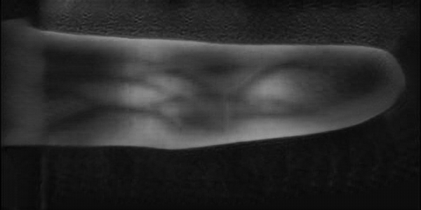<br><center><font size="6">Shift</font></center> | 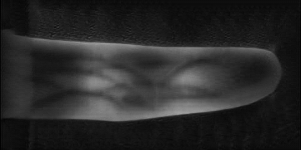<br><center><font size="6">Shift</font></center> | 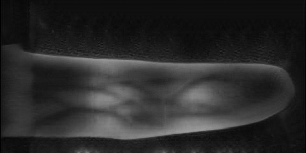<br><center><font size="6">Shift</font></center> | 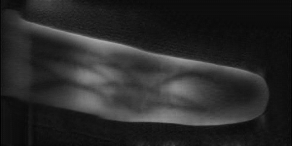<br><center><font size="6">Rotate</font></center> | 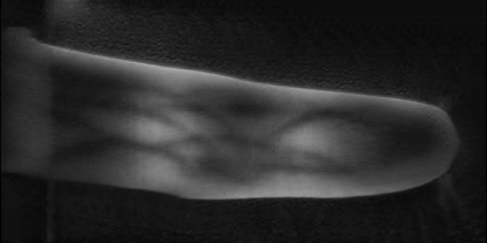<br><center><font size="6">Rotate</font></center> | 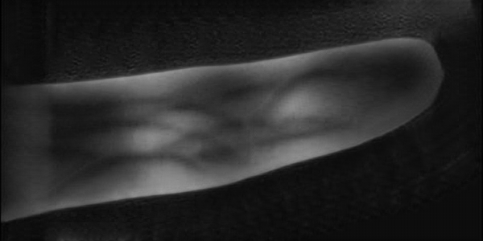<br><center><font size="6">Rotate</font></center> |
| 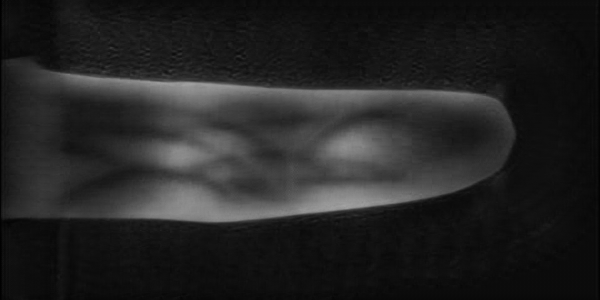<br><center><font size="6">Scale</font></center> | 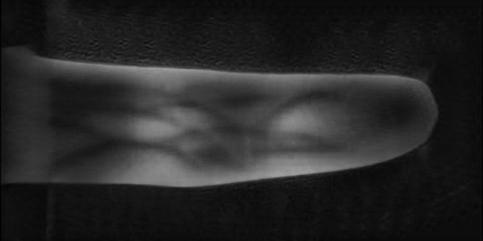<br><center><font size="6">Scale</font></center> | 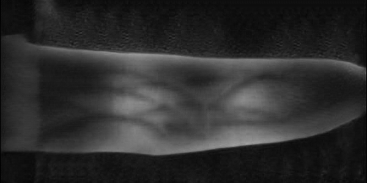<br><center><font size="6">Scale</font></center> | 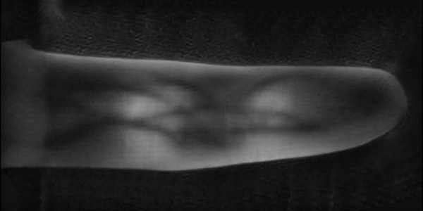<br><center><font size="6">Roll</font></center> | 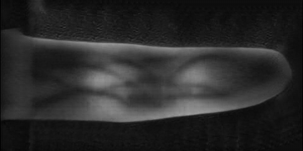<br><center><font size="6">Roll</font></center> | 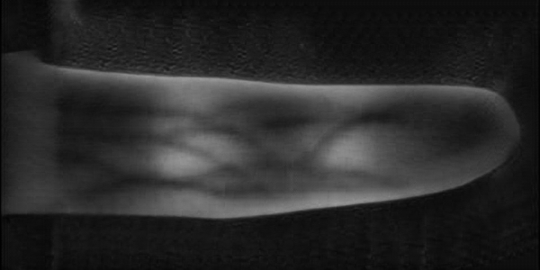<br><center><font size="6">Roll</font></center> |
| <br><center><font size="6">OpticalBlur</font></center> | <br><center><font size="6">OpticalBlur</font></center> | <br><center><font size="6">OpticalBlur</font></center> | 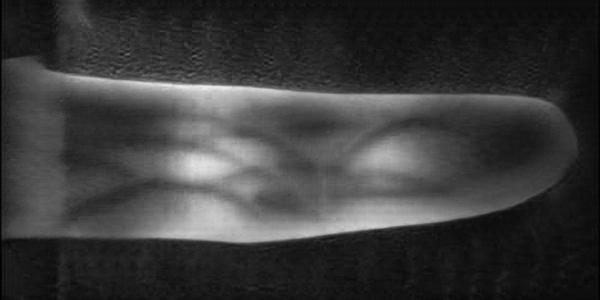<br><center><font size="6">Exposure</font></center> | 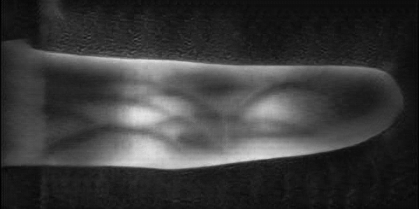<br><center><font size="6">Exposure</font></center> | 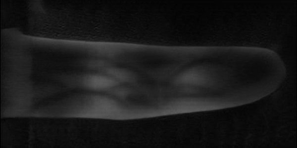<br><center><font size="6">Exposure</font></center> |
| <br><center><font size="6">SkinScatter</font></center> | <br><center><font size="6">SkinScatter</font></center> | 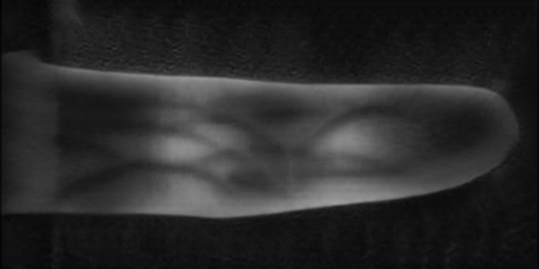<br><center><font size="6">SkinScatter</font></center> | <br><center><font size="6">MotionBlur</font></center> | 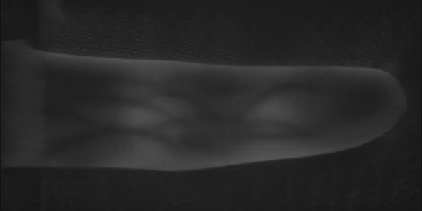<br><center><font size="6">MotionBlur</font></center> | 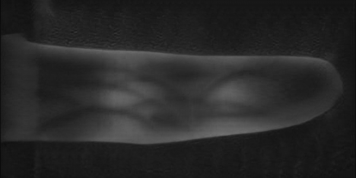<br><center><font size="6">MotionBlur</font></center> |
| 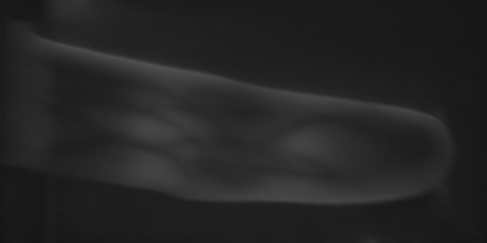<br><center><font size="6">Multi</font></center> | 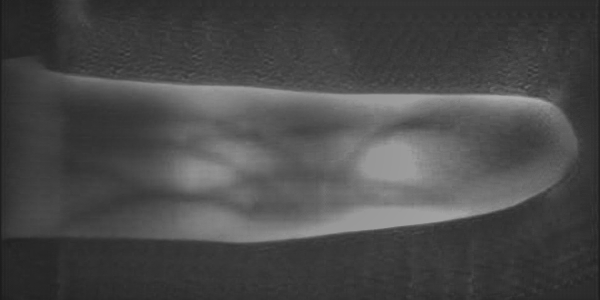<br><center><font size="6">Multi</font></center> | 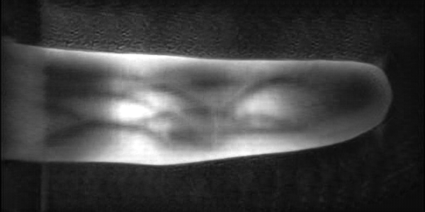<br><center><font size="6">Multi</font></center> | 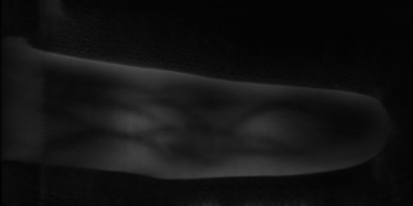<br><center><font size="6">Multi</font></center> | 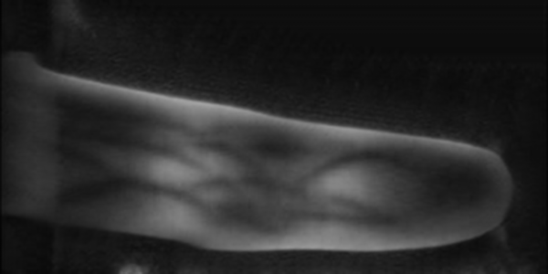<br><center><font size="6">Multi</font></center> | 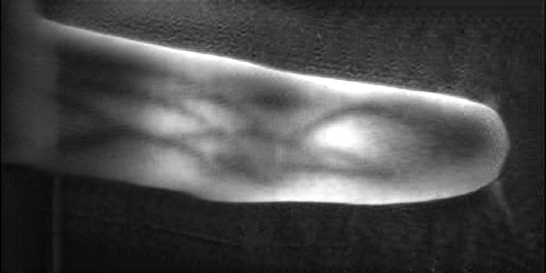<br><center><font size="6">Multi</font></center> |


## Inter-class Variations
The dataset contains systematic variations to simulate real-world conditions:

| Variation Type       | Parameters                          |
|----------------------|-------------------------------------|
| Geometric            | Shift (±15px), Rotate (±15°), Scale (±10%) ,Roll (±15°) |
| Photometric          | Exposure (±30%), Contrast (±20%)    |
| Degradation          | Motion blur (kernel size 3-7), Optical blur (σ=1-3) |

## Mask Visualizations
### Shape Mask
### Pattern Mask
## Citation
If you use this dataset in your research, please cite:
```
[Author(s)]. DOI:xxxx
```

## Contact
For questions or reporting issues:
- *Yinfan Wang*, *Jie Gui*
- Email: 230239767@seu.edu.cn
